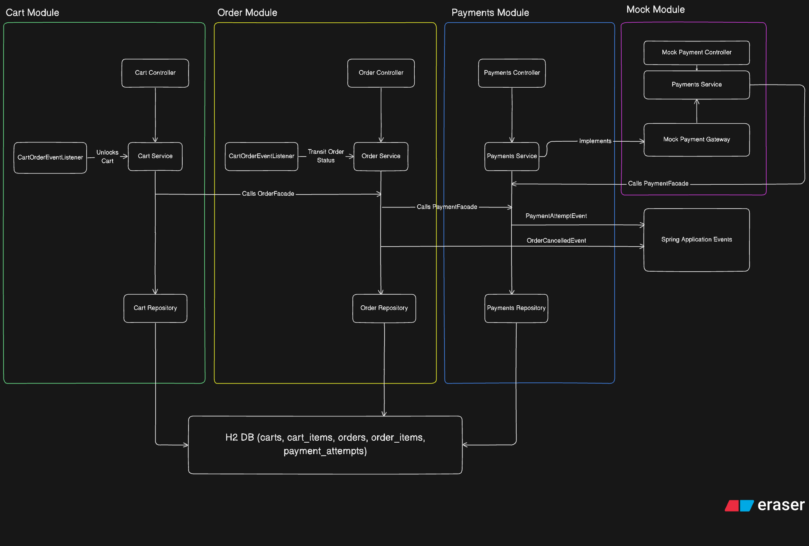
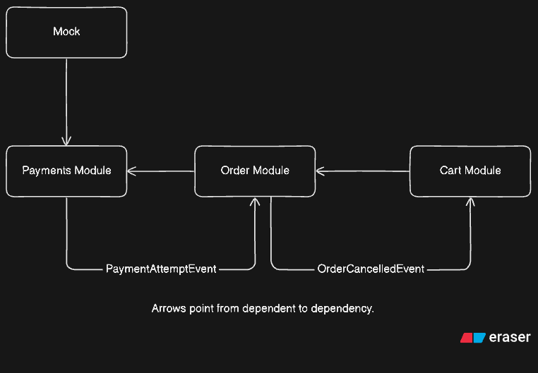
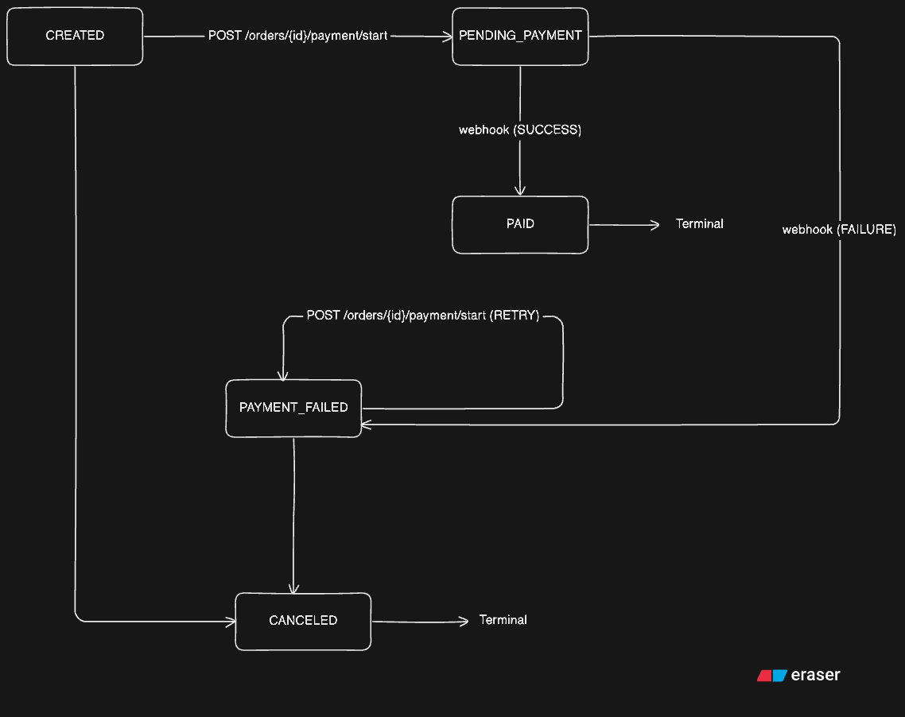

# Ecommerce

A Spring Boot backend for a small e-commerce system. Handles cart management, order lifecycle, and payment processing with a mock payment provider.

## Requirements

To run with Maven: Java 21, Maven

To run with Docker: Docker

## Running

**Maven**

```bash
mvn spring-boot:run
```

**Docker**

```bash
docker build -t ecommerce .
docker run -p 8080:8080 ecommerce
```

The app starts on port 8080 with an in-memory H2 database. No external dependencies.

H2 console: `http://localhost:8080/api/v1/h2-console`
Swagger UI: `http://localhost:8080/api/v1/swagger-ui.html`

## Running tests

```bash
mvn test
```

## Architecture



The project is structured as a modular monolith. Modules communicate through facade interfaces only — no module reaches into another module's repository or internal types. Cross-module side effects use Spring application events.

```
cart      — cart and item management
order     — order lifecycle and state machine
payment   — payment attempts and webhook handling
mock      — mock payment provider
shared    — base entity, service, REST response wrapper, global exception handler, and swagger configuration
```

### Dependency graph



Arrows point from dependent to dependency. Events flow in the reverse direction without introducing dependency cycles.

## Order state machine



PAID and CANCELED are terminal states. All transitions are enforced in `OrderStatus.canTransitionTo()`.


## Idempotency

- Only one PENDING payment attempt is allowed per order at a time. Starting payment while one is active returns 400.
- Duplicate webhooks are rejected if the attempt is already in a terminal state (SUCCESS or FAILED). The order state is not touched.

## Key decisions

**Modular monolith over microservices** — the system is not expected to scale. A monolith with clear module boundaries gives the same separation of concerns without the operational overhead. And it's easier to switch to microservices later if needed since each module has a separate business and a well-defined interface.

**Facades for inter-module communication** — each module exposes an interface. Other modules depend on the interface, not the implementation. This makes boundaries explicit and keeps dependencies one-directional.

**Events for reverse dependencies** — when Order needs to notify Cart (cancel unlocks cart) or Payment needs to notify Order (webhook result), it publishes a Spring application event. This avoids circular dependencies between modules.

**PaymentAttempt as the idempotency record** — the attempt entity tracks its own status. The webhook handler checks the attempt status before doing anything, making duplicate processing impossible without any separate idempotency key store.

## Endpoints

```
POST   /carts
POST   /carts/{cartId}/items
PATCH  /carts/{cartId}/items/{itemId}?quantity=
POST   /carts/{cartId}/checkout

GET    /orders
GET    /orders/{orderId}
POST   /orders/{orderId}/payment/start
POST   /orders/{orderId}                 (cancel)

GET    /payments
GET    /payments/{paymentAttemptId}
POST   /payments/webhook

POST   /mock-payments/{attemptId}/confirm
POST   /mock-payments/{attemptId}/fail
```

## Assumptions

- Price is set by the client when adding items to the cart. There is no product catalog.
- Authentication is out of scope.